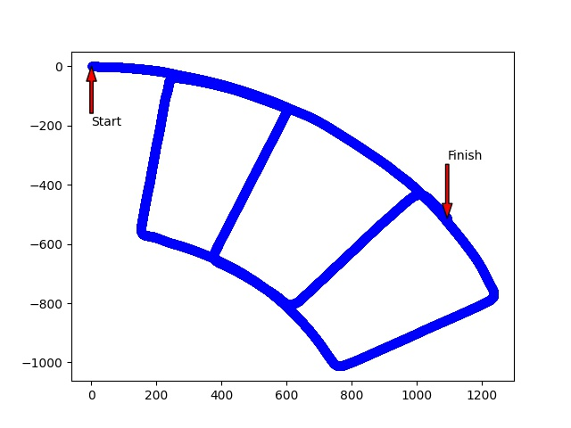
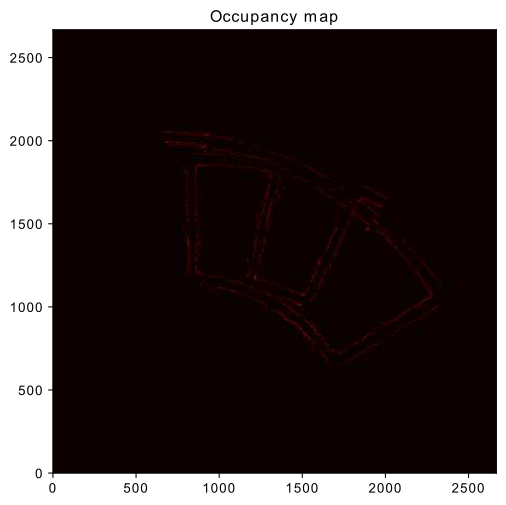
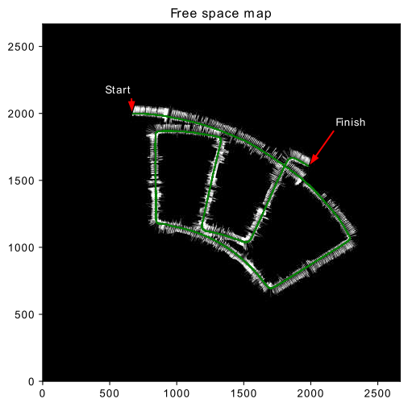
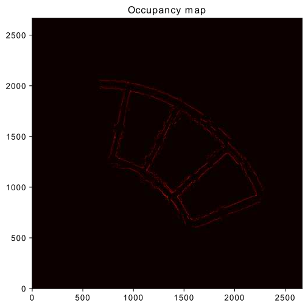
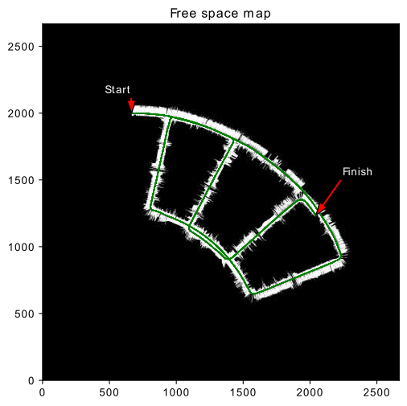
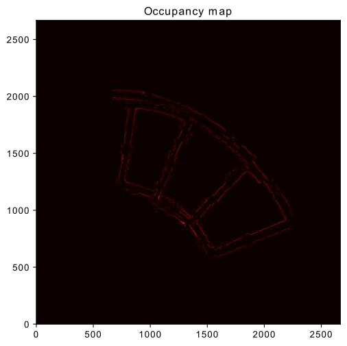
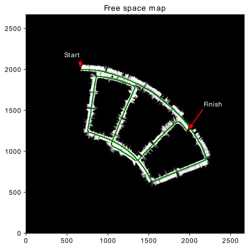

# About
*This project implemented a Bayes Filter to solve the Simultaneous Localization and Mapping(SLAM) problem on a robot moving in an initially unknown environment. *Specifically we implemented a Bayes Particle Filter that uses a set of discrete particles to estimate the robot pose at any given time. We also built a occupancy based grid map to create a visual map of the environment the robot is moving in. The map is build using the LIDAR range sensor that is provided to us. 

## Environment Setup
* To replicate the project, first build a conda environment using the provided ece276a.yaml file as follows : 
<pre> $conda env create -f ece276a.yaml</pre>
* Finally activate the conda environment 
<pre> $conda activate ece276a </pre>

## File Details
Files are structered in the code folder. 
<pre>
code
├── data
│   ├── image_left.png
│   └── image_right.png
├── dead_reckon.py
├── param
│   ├── EncoderParameter.txt
│   ├── left_camera.yaml
│   ├── lidar_param.txt
│   ├── right_camera.yaml
│   ├── stereo_param.txt
│   ├── Vehicle2FOG.txt
│   ├── Vehicle2Lidar.txt
│   └── Vehicle2Stereo.txt
├── pr2_utils.py
├── __pycache__
│   └── pr2_utils.cpython-36.pyc
├── requirements.txt
├── sensor_data
│   ├── encoder.csv
│   ├── fog.csv
│   └── lidar.csv
├── slam.py
├── texture_img_2.pkl
├── texture_map.eps
├── texture_mapping.ipynb
├── texture_mapping.py
└── texture.py
</pre>

### a. dead_reckon.py 
This script is used to get the dead reckon trajectory of the robot which uses only the prediction step of the Bayes Filter with no noise. This is helpful in getting a look at the approximate range of motion that the robot performs. Usage ;-
<pre> $python3 code/dead_reckon.py </pre>

### b. slam.py
This script is used to run the main SLAM Particle Filter algorithm. This script uses the encoder, lidar and fog data present in sensor_data folder to perform the predict and the update step of the Particle Filter. It also builds the occupancy based grid map. The script takes as input the number of particles that you want to use and the noise in the angular velocity component of the control input. Usage :- 
<pre>$python3 code/slam.py 100 0.002 </pre>

### c. texture_mapping.py
This script is used to apply texture to the map using the stereo RGB images provided in the stereo_images folder. It computes the disparity images and uses these to get the depth map of the pixels, and use these and stereo camera models to get the world coordinates of the ground in the map and then get the rgb values of these points from the stereo rgb image. Usage :- 
<pre>$python3 code/texture_mapping.py </pre>

## Technical Report
* [Sambaran Ghosal. "Color Segementation and Object Detection" Feb 2022](report/Project1.pdf)

## Results

### Dead Reckoning

   

### Case 1 (N = 10):

  
   

### Case 2 (N = 100):

  
   

### Case 3 (N = 500):

  
   

